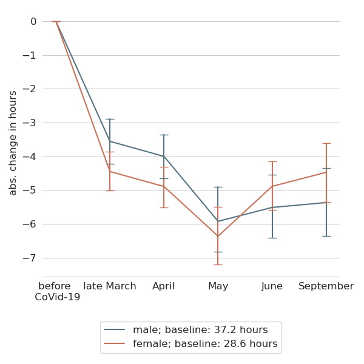

:Title: The CoViD-19 crisis and the gender division of market and household work
:Authors: Hans-Martin von Gaudecker, Radost Holler, Lena Janys, Bettina Siflinger, Christian Zimpelmann
:Organization: Universität Bonn & IZA
:Copyright: Creative Commons

Introduction
============

* Data from the Netherlands
  * Hours of work: February — September 2020
  * Time use: November 2019, April 2020
* On average, women reduce one hour extra during lockdown, effect vanishes by June
* No additional effect of children being present in the household on either parent!
* Allocation of additional childcare depends on hours of work pre-CoViD:
  * If both parents work full-time before pandemic: roughly equal shares
  * Combinations FT / PT or FT / no work: Gender care gap increases

.. * Typically 37 + 32 hours than 45 + 45

.. raw:: latex
    
    \clearpage

Data: Background
================

* LISS: Online Panel in the Netherlands, running since 2007
* Sibling of UAS
  * Descendant of CentERpanel
  * Joint usage via `Open Probability-Based Panel Alliance <https://openpanelalliance.org/>`_
* Roughly 5,000 households / 7,500 individuals
* Each month, respondents get ≅30 minutes of questionnaires
* Around 85% of respondents can be linked to administrative microdata (not today)

.. * Based on probability sample
.. * Background data on Work, Health, Income, ...
.. * Questionnaires designed by researchers (~85c / minute / respondent)

Data: CoViD-19 surveys, Time Use
================================

* CoViD-19 questionnaires
  * March 20-31, April 6-28, May, June, September
  * See https://liss-covid-19-questionnaires-documentation.readthedocs.io/
  * Will mostly use hours of work
* Time use & consumption questionnaires
  * Baseline: November 2019
  * **April 21-28:** Similar to November 2019 edition, adapted to lockdown situation
* **November**: Similar to November 2019, adapted to current situation

.. raw:: latex
    
    \clearpage

Hours worked / worked from home
===============================

|pic1|  |pic2|

.. |pic2| image:: work-childcare/abs-change-hours-home-over-time-by-gender-full-unconditional.png
   :width: 35%

Fixed effects regressions: Full sample
======================================

* LHS: Hours of work
* RHS: Gender × month × (1, part time, essential worker, age), month × age

  * Non-essential, FT women: 3 hours addt'l reduction during lockdown relative to men, gone by June
  * Partial effect of essential for females: 4.4 hours, gone quickly

* RHS: Add month × (percentage of work doable from home, self-employment, profession, sector)

  * No change

* RHS: Add gender × month × children under 12 at home

  * No change
  * If anything, hours are better preserved among (both) parents
  * Other coefficients very similar when restricting sample to 2-parent families

Full-time / Non-working couples
===============================

.. image:: work-childcare/stacked-bar-plot-market-nonmarket-details-split-50-fulltime-olf.png

Full-time / Part-time couples
=============================

.. image:: work-childcare/stacked-bar-plot-market-nonmarket-details-split-50-fulltime-parttime.png

Full-time x2 couples
====================

.. image:: work-childcare/stacked-bar-plot-market-nonmarket-details-split-50-both-fulltime.png

Takeaways
=========

- Gender division of tasks during CoViD-19: Very heterogeneous
  - Not back to the 1950s
  - Not the great equalizer
  - Pre-existing patterns re-inforced
- Western Europe: Work hours of women (relatively) well preserved
  - Consequence of highly subsidised daycare with comparably short hours?
- Glimpse of hope in the long run via changed norms?
  - Home office accepted for men
  - No long commute on 2-3 days
  - Available for childcare emergencies?
