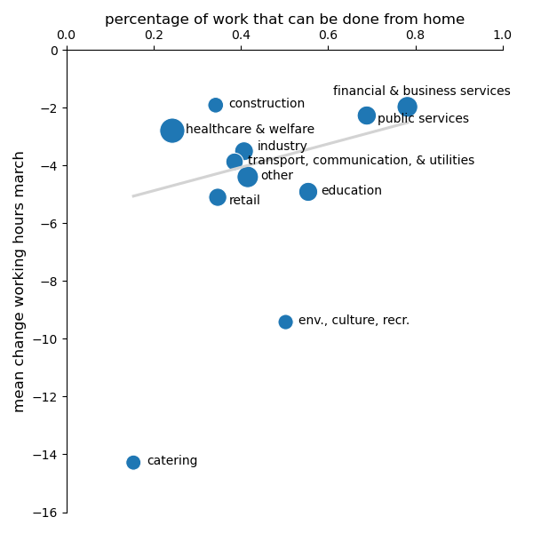
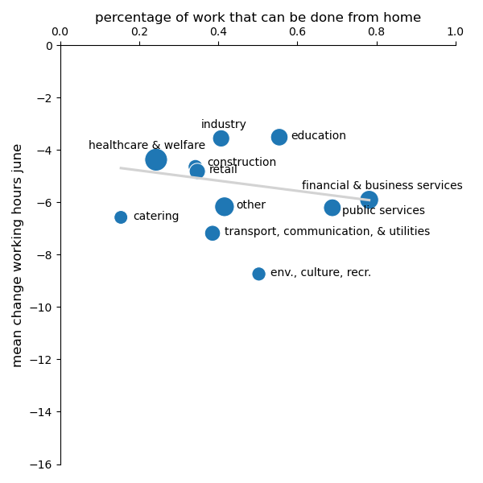

:Title: An introduction to the LISS (CoViD-19) data
:Authors: Hans-Martin v. Gaudecker
:Organization: Universität Bonn & IZA
:Copyright: Creative Commons

Background
==========

* LISS: Online Panel in the Netherlands, running since 2007
* Based on probability sample
* Roughly 5,000 households / 7,500 individuals
* Each month, respondents get 30 minutes of questionnaires

  * Background data on Work, Health, Income, ...
  * Questionnaires designed by researchers (~85c / minute / respondent)

* Around 85% of respondents can be linked to administrative microdata

CRC data collection
===================

* C01: Panel of ambiguity attitudes / stock market beliefs (see my presentation this afternoon if interested)
* A01, A02, C01: Risk / time social preferences, parental expectations for children's careers, ...
* A03: Within-household financial decisions

CoViD-19 surveys
================

* See https://liss-covid-19-questionnaires-documentation.readthedocs.io/
* **March 20-31:** Risk perceptions, behavioural reactions and preferences re social distancing policies, changes in the work and childcare situation, intentions and expectations regarding consumption/savings decisions, mental health
* **April 6-28:** Risk perceptions, number of personal contacts, changes in the work situation, income and macro expectations
* **May** Mostly labour, some health, home schooling
* **June** Mostly labour, lots of job search, how do parents deal with opening of daycares / primary schools?
* **September**: Risk perceptions, support for policies, changes in the work situation, income and macro expectations
* **Hopefully three more waves!**

(CoViD-19) Time use & consumption
=================================

* **November 2019**: Baseline, helped redesign survey
* **April 21-28:** Similar to November 2019 edition, adapted to lockdown situation
* **November**: Similar to November 2019, adapted to current situation
* **Hopefully another round November 2021**

Some results
=============

* Hours worked by essential worker status and capability to work from home
* Gender division of tasks

Hours worked
============

|pic1|  |pic2|

.. |pic1| image:: work-childcare/abs-change-hours-over-time-by-work_perc_home_cat_only_noness_ger-full-unconditional.png
   :width: 35%

.. |pic2| image:: work-childcare/abs-change-hours-over-time-by-work_perc_home_cat_only_ess_ger-full-unconditional.png
   :width: 35%

Hours worked from home
===========================

|pic3|  |pic4|

.. |pic3| image:: work-childcare/abs-change-hours-home-over-time-by-work_perc_home_cat_only_noness_ger-full-unconditional.png
   :width: 35%

.. |pic4| image:: work-childcare/abs-change-hours-home-over-time-by-work_perc_home_cat_only_ess_ger-full-unconditional.png
   :width: 35%

Hours worked by sector
===========================

|pic5|  |pic6|

Gender division of tasks
========================

* On average, women reduce one hour extra during lockdown, effect vanishes by June
* No addtional effect of children being present in the household on either parent!
* If both parents work full-time before pandemic: roughly equal shares of additional childcare

  * Typically 37 + 32 hours than 45 + 45

* Combinations FT / PT or FT / no work: Gender care gap increases
* Currently working on explaining this in model with specialization / subsidized childcare for relatively short hours

Other current projects
======================

* Mental health (with Michaela Paffenholz, Sebastian Seitz, Bettina Siflinger, Moritz Mendel)
* Evolution of income / macro expectations (with Moritz Mendel, Simon Heiler)

.. raw:: latex

    \clearpage

More users wanted!
==================

* Data come largely cleaned up
* Huge potential of data for "serious" research
  
  - Baseline
  - Many data collected when it mattered (will matter)
  - Follow-up, including in administrative data

* Far more than current team could potentially do
* Broad base of CRC users helpful for additional funding
* Doodle for brainstorming meeting https://doodle.com/poll/xr7452ay2qryz2gx
* e-Mail me / let's chat! 
