:Title: Erste Ergebnisse
:Authors: Hans-Martin v. Gaudecker & `CoViD-19 Impact Lab <https://covid-19-impact-lab.readthedocs.io/en/latest/about_us.html>`__ Team
:Organization: Universität Bonn & IZA
:Course: Soziale und ökonomische Auswirkungen der Coronaviruskrise:
:Copyright: Creative Commons

Die Anfänge
===========

* Mitte März: Lockdowns in Europa
* Impuls: wirtschafts- und sozialwissenschaftlich begleiten
* Langjährige Datensammlung im SFB / TR 224 im LISS Panel (NL)
* Eine Woche später im Feld mit 15-min Umfrage

LISS Panel: Hintergrund
=======================

* Panel: Dieselben Personen / Haushalte werden immer wieder befragt
* Online, läuft seit 2007
* Wahrscheinlichkeitsbasierte Stichprobe, ~7000 Personen
* Reichhaltige Hintergrunddaten
* Umfragedaten können mit Verwaltungsdaten zusammengeführt werden

Ausmaß Datensammlung
====================

* **20-31 März:** Ansteckungsrisikoperzeptionen, Verhaltensänderungen hinsichtlich Ansteckungsgefahr, Einstellungen zu den sozialen Distanzierungsmaßnahmen, Änderungen in der Arbeitsmarkt- und Kinderbetreuungssituation, Absichten und Erwartungen hinsichtlich Konsum/Sparentscheidungen, mentale Gesundheit **(Finanzierung: ECONtribute)**.
* **6-28 April:** Ansteckungsrisikoperzeptionen, Zahl persönlicher Kontakte, Änderungen in der Arbeitsmarktsituation, Einkommens- und gesamtwirtschaftliche Erwartungen  **(Finanzierung: ECONtribute)**
* **21-28 April:** Zeitnutzung un Konsum, ähnlich zu November 2019, besonderer Fokus auf Kinderbetreuung und homeschooling **(Finanzierung: CRC/TR 224)**
* **4-26 Mai:** Ansteckungsrisikoperzeptionen, Arbeitsmarktsituation, Nutzung wirtschaftlicher Unterstützungsprogramme, homeschooling **(Finanzierung: NWO/IZA)**
* **1-30 Juni:** Ansteckungsrisikoperzeptionen, Zahl persönlicher Kontakte, Umgang mit Lockerungsmaßnahmen, Arbeitsmarktsituation, Jobsuche **(Finanzierung: NWO/IZA)**

Situation in den NL
====================

* März: Liebäugeln mit Herdenimmunität
* Letztlich ähnliche Maßnahmen wie in D
* Öffnungen seit Anfang Mai

  * KiTas und Grundschulen: Schneller (11. Mai / 8. Juni)
  * Gastronomie: Langsamer (8. Juni)
* Deutlich höhere Sterblichkeit, aber kein völlig überlaufenen Intensivstationen

Univariate Statistiken
======================

* Sehen Sie selbst: https://covid-19-impact-lab.iza.org/de/app

Kein trade-off zwischen Unterstützung für soziale Distanzierungsmaßnahmen und individuellen ökonomischer Konsequenzen
===============================================================================================================================

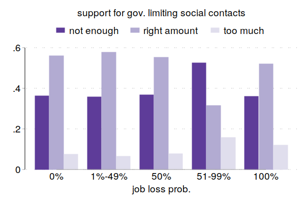

Kein trade-off zwischen Unterstützung für soziale Distanzierungsmaßnahmen und individuellen ökonomischer Konsequenzen
===============================================================================================================================

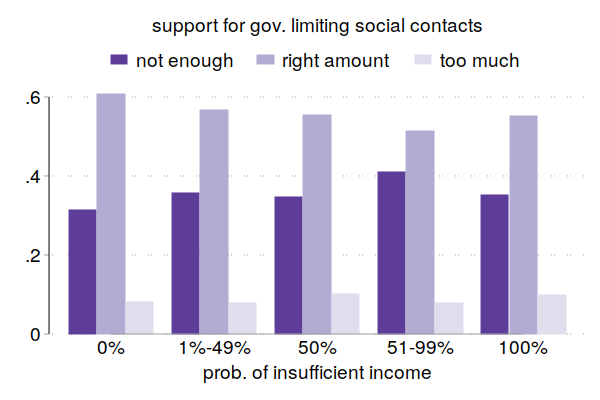

Aber Wunsch nach zusätzlicher Unterstützung, um die ökonomischen Konsequenzen abzufedern
==================================================================================================

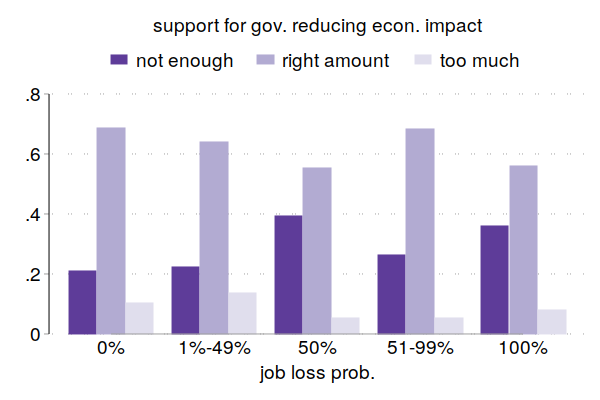

Aber Wunsch nach zusätzlicher Unterstützung, um die ökonomischen Konsequenzen abzufedern
==================================================================================================

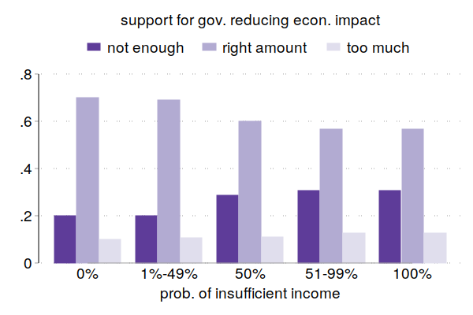

Arbeitsstunden
==============

* Siehe Hans-Martin von Gaudecker, Radost Holler, Lena Janys, Bettina M. Siflinger, Christian Zimpelmann: Labour Supply in the Early Stages of the COVID-19 Pandemic: Empirical Evidence on Hours, Home Office, and Expectations,  IZA DP No. 13158
* Oder Pressemitteilung: https://selten.institute/2020/04/17/econtribute-studie-coronavirus-geringverdiener-sind-doppelte-verlierer-der-coronakrise/

Änderung im Zustand nach Art der Beschäftigung
===============================================

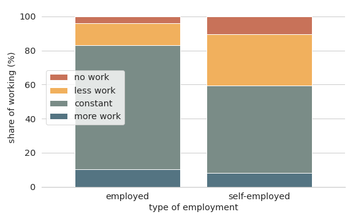

Arbeitsstunden nach Art der Beschäftigung
=========================================

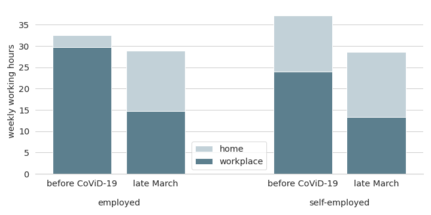

Arbeitsstunden nach Systemrelevanz der Arbeit
=============================================

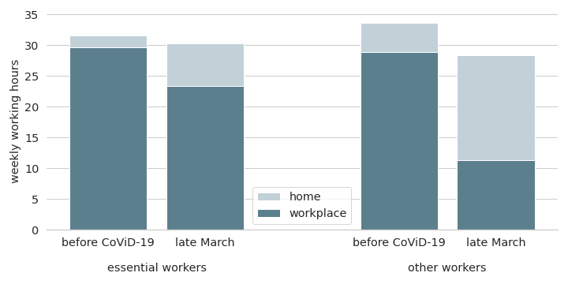

Arbeitsstunden nach Bildungsgrad
====================================

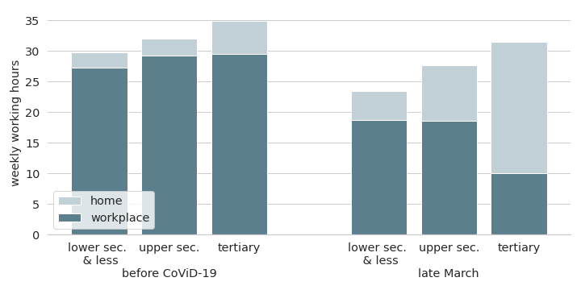

Änderung in Arbeitsstunden nach Bildungsgrad im Sektor
======================================================

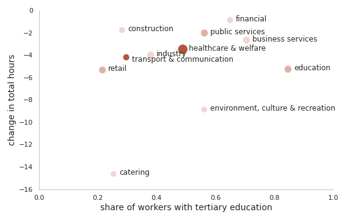

Änderung in Home Office nach Bildungsgrad im Sektor
======================================================

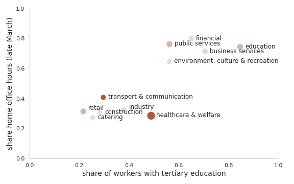

Änderung Arbeitsstunden nach Geschlecht
=======================================

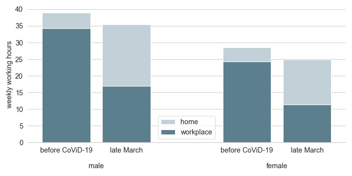

Änderung Arbeitsstunden nach Geschlecht (absolut)
=================================================

.. image:: work-childcare/q-change-hours-absolute.png
    :width: 60%
    :align: center

Änderung Arbeitsstunden nach Geschlecht (relativ)
=================================================

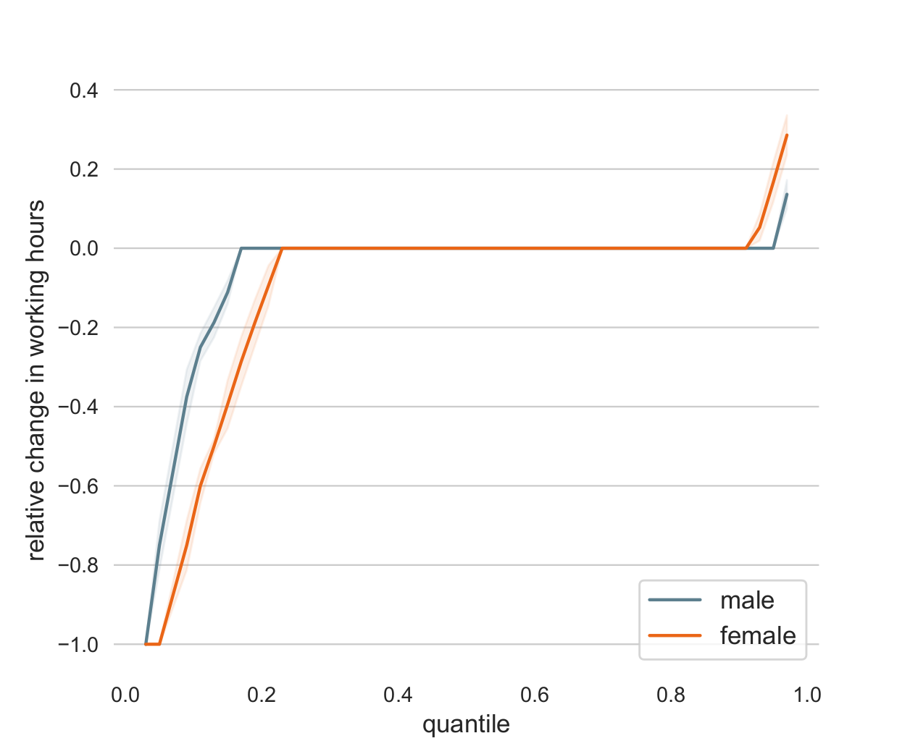

Mentale Gesundheit
==================

* Kurzform eines Screening-Tests (MHI-5)
* Dimensionen:

  * sehr nervös -
  * entmutigt und traurig -
  * nichts aufheitern -
  * glücklich +
  * ruhig und gelassen +

* Skalen 0-5 (höhere Werte besser) ⨉ 4: 0 (schlecht) - 100 (gut)

Mentale Gesundheit
==================

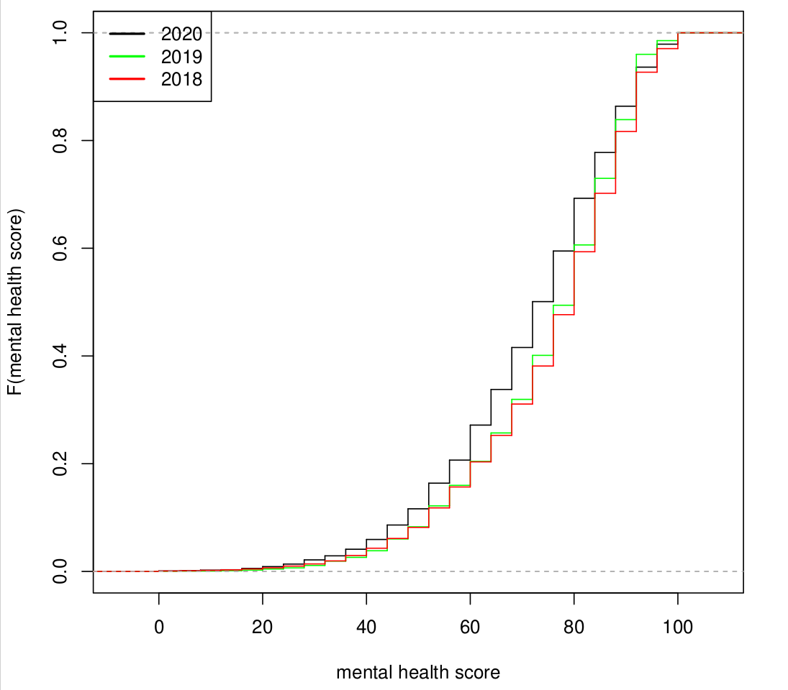

Welche Gruppen am stärksten betroffen?
======================================

* Gruppen, die vorher hohes Risiko für mentale Gesundheitsprobleme hatten, sehen wenig Änderungen
* Väter haben die größten Änderungen

  * extrem wenig Indikationen für mentale Gesundheitsprobleme vorher
  * plötzlich Risikogruppe.

* Jobsorgen oder Doppelbelastung?
* Achtung: Erste Wochen des lockdowns!

Zusammenfassung und Ausblick
============================

* Nordwesteuropa: Hohe Zustimmung zu lockdowns, über Bevölkerungsgruppen hinweg
* Großer Effekt auf Arbeitsmarkt, durch Kurzarbeit (noch) abgefedert
* Aber klar, dass er weniger gebildete härter trifft
* Frauen sind am Arbeitsmarkt stärker betroffen, Einfluss auf Rollenverteilung sehr heterogen
* Mentale Gesundheitsrisiken steigen
