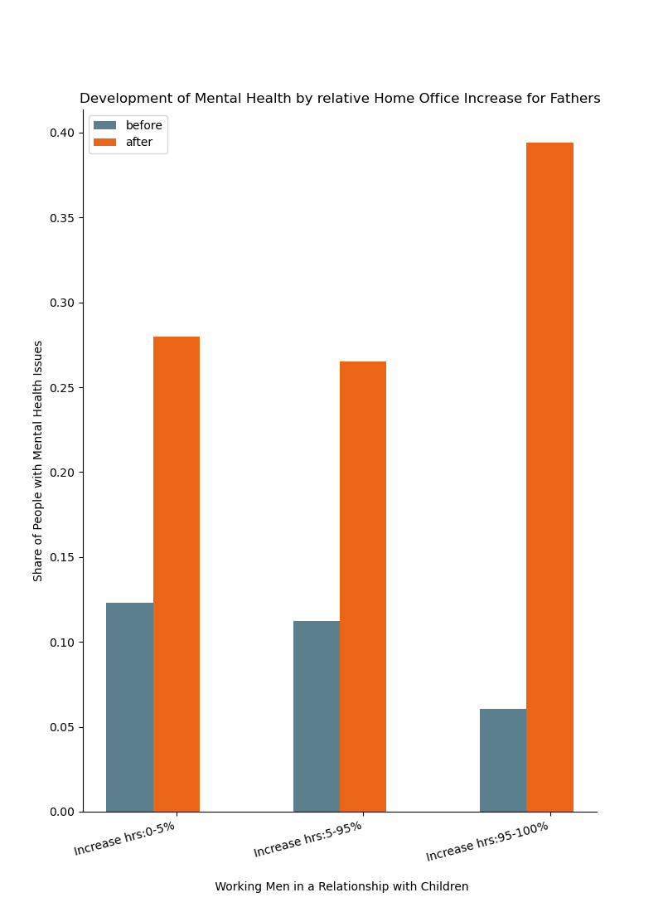
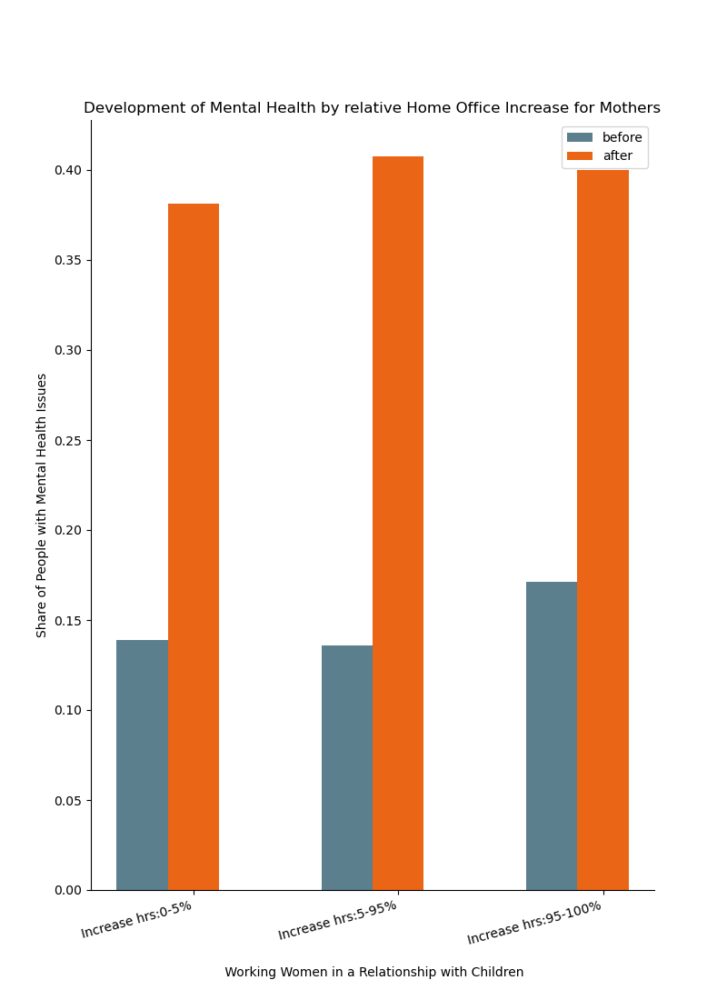

:Title: Early Survey Evidence
:Authors: Hans-Martin v. Gaudecker & the `CoViD-19 Impact Lab <https://covid-19-impact-lab.readthedocs.io/en/latest/about_us.html>`__ team
:Organization: Universität Bonn & IZA
:Course: The Impact of CoViD-19 on Society
:Copyright: Creative Commons

Background
==========

* LISS panel a long-running Dutch Internet Panel (since 2007)
* Probability-based sample, ~7000 respondents
* Data can be linked to administrative records at an individual-level
* Christian and me have collected lots of data on ambiguity there for the past two years (and I did some stuff previously)

CoViD-19 surveys
================

* **March 20-31:** Risk perceptions, behavioural reactions and preferences re social distancing policies, changes in the work and childcare situation, intentions and expectations regarding consumption/savings decisions, mental health **(financed by ECONtribute)**.
* Some questions fielded in parallel in GESIS Panel (online only)
* **April 6-28:** Risk perceptions, number of personal contacts, changes in the work situation, income and macro expectations **(financed by ECONtribute)**
* **April 21-28:** Time Use and Consumption survey, similar to November 2019 edition, adapted to current situation **(financed by CRC/TR 224)**
* **May and beyond:** Many ideas, no funding confirmed at this point.

Data preparation pipeline
=========================

* 15min is a lot of interview time.
* Lots of complex questions / answering options
* 12 years of background info...
* A big **thank you** to everybody who helped cleaning this up, especially Moritz Mendel and Christian Zimpelmann, who took the lead!

Univariate distributions of answers, also by background characteristics
========================================================================

* See for yourselves: https://covid-19-impact-lab.iza.org/
* Thanks to Klara Röhrl and Janos Gabler!
* More to come (maps, bivariate distributions)

Gist on social distancing policies
==================================

* High rated effectiveness
* Deemed appropriate, if anything not strict enough
* Interesting pattern of belief in others following a hypothetical curfew and own intended behaviour (Ingo)
* No striking heterogeneities
* Sometimes the absence of heterogeneity can be interesting! (next slides are courtesy of Maria)

No trade-offs in support for social distancing policies and individual economic consequences
==================================================================================================

.. image:: fig-econ-exp/gov_pub_jobloss_ng.png
    :width: 60%
    :align: center

No trade-offs in support for social distancing policies and individual economic consequences
==================================================================================================

But calls for more government intervention in terms of cushioning the economic consequences
==================================================================================================

.. image:: fig-econ-exp/gov_econ_jobloss_ng.png
    :width: 60%
    :align: center

But calls for more government intervention in terms of cushioning the economic consequences
==================================================================================================

.. image:: fig-econ-exp/gov_econ_fd.png
    :width: 60%
    :align: center

Hours of work
=============

* Thanks to Radost Holler, Lena Janys, Bettina Siflinger, and Christian Zimpelmann!
* Results based on a question where respondents were asked to fill in a 2⨉2 matrix on working hours, before the coronavirus crisis / in the week preceding the interview.

Hours of work
=============

.. image:: work-childcare/working-hours-overall.png
    :width: 60%
    :align: center

Hours of work by education
==========================

.. image:: work-childcare/final-working-hours-by-edu2.png
    :width: 60%
    :align: center

Hours of work by education and income group
===========================================

.. image:: work-childcare/home-office-within-income-by-edu3.png
    :width: 90%
    :align: center

Mental health
=============

* Thanks to Bettina Siflinger, Michaela Paffenholz, Sebastian Seitz, and Moritz Mendel!
* Please do not take the following prevalence rates literally, we still need to work on incorporating different timeframes ("past month" for baseline, "past seven days" for the March 2020 data)

Mental health (fathers)
=======================

Mental health (mothers)
=============================================

