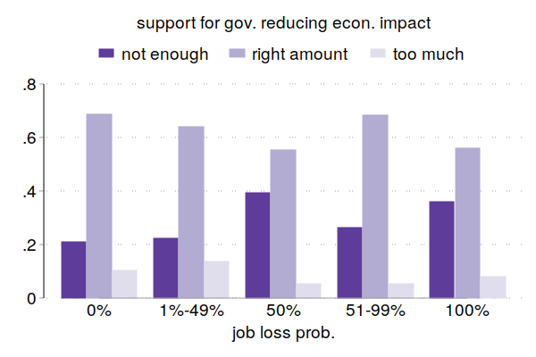
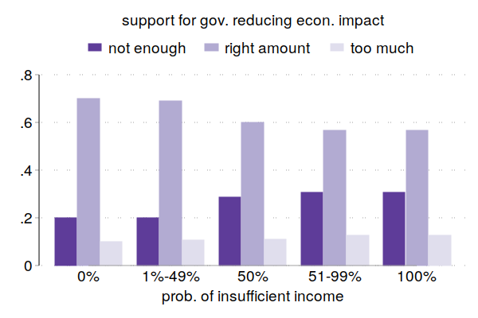

:Title: Early Survey Evidence
:Authors: Hans-Martin v. Gaudecker & the `CoViD-19 Impact Lab <https://covid-19-impact-lab.readthedocs.io/en/latest/about_us.html>`__ team
:Organization: Universität Bonn & IZA
:Course: The Impact of CoViD-19 on Society
:Copyright: Creative Commons

Background
==========

* LISS panel a long-running Dutch Internet Panel (since 2007)
* Probability-based sample, ~7000 respondents
* Data can be linked to administrative records at an individual-level
* Christian and me have collected lots of data on ambiguity there for the past two years (and I did some stuff previously)

CoViD-19 surveys
================

* **March 20-31:** Risk perceptions, behavioural reactions and preferences re social distancing policies, changes in the work and childcare situation, intentions and expectations regarding consumption/savings decisions, mental health **(financed by ECONtribute)**.
* Some questions fielded in parallel in GESIS Panel (online only)
* **April 6-28:** Risk perceptions, number of personal contacts, changes in the work situation, income and macro expectations **(financed by ECONtribute)**
* **April 21-28:** Time Use and Consumption survey, similar to November 2019 edition, adapted to current situation **(financed by CRC/TR 224)**
* **May and beyond:** Many ideas, no funding confirmed at this point.

Data preparation pipeline
=========================

* 15min is a lot of interview time.
* Lots of complex questions / answering options

Univariate distributions of answers, also by background characteristics
========================================================================

* See for yourselves: https://covid-19-impact-lab.iza.org/
* Thanks to Klara Röhrl and Janos Gabler!
* More to come (maps, bivariate distributions)

Gist on social distancing policies
==================================

* High rated effectiveness
* Deemed appropriate, if anything not strict enough
* No striking heterogeneities
* Sometimes the absence of heterogeneity can be interesting! (next slids courtesy of Maria)

No trade-offs in support for social distancing policies and individual economic consequences
==================================================================================================

.. image:: fig-econ-exp/gov_pub_jobloss_ng.png
    :width: 60%
    :align: center

No trade-offs in support for social distancing policies and individual economic consequences
==================================================================================================

.. image:: fig-econ-exp/gov_pub_fd.png
    :width: 60%
    :align: center

But calls for more government intervention in terms of cushioning the economic consequences
==================================================================================================

But calls for more government intervention in terms of cushioning the economic consequences
==================================================================================================

