# Gist of results

- Labour market:
  - Small effects on extensive margin
  - Hours of work took deep dive, back up quickly
  - Early support programmes worked well
  - No rise in inequality
- Mental well-being:
  - Strong reduction in mental health score in March
  - Back up to ≈normal levels by May
  - Very different for parents depending on who buffers shock

# Based on two papers

1. Gaudecker, H.-M. von, Holler, R., Janys, L., Siflinger, B. M., & Zimpelmann, C. (2020). _Labour Supply during Lockdown and a "New Normal": The Case of the Netherlands_. IZA DP 13623.
2. Siflinger, B., Paffenholz, M., Seitz, S., Mendel, M., Gaudecker, H.-M. von (2021). _The CoViD-19 Pandemic and Mental Health: Distentangling Crucial Channels_. CRC 224 DP 271.

# LFP / Unemployment rates

{width="48%"}
{width="48%"}

# Hours of work

- Best short-term measure for labour market activity in presence of
  - firing restrictions
  - employment subsidies
- Interpretation as labour demand / direct restrictions seems fine
  - e.g., see below that no add'l effect for parents
- Measurement before CoViD-19 likely a bit too high

# Hours worked / worked from home

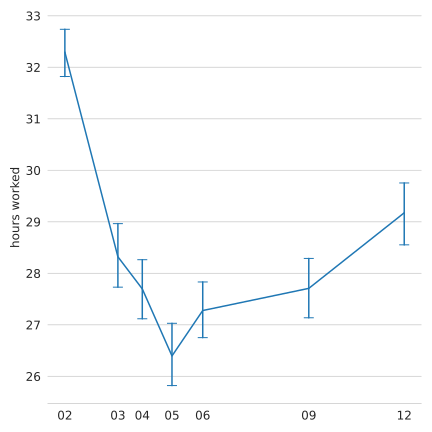{width="48%"}
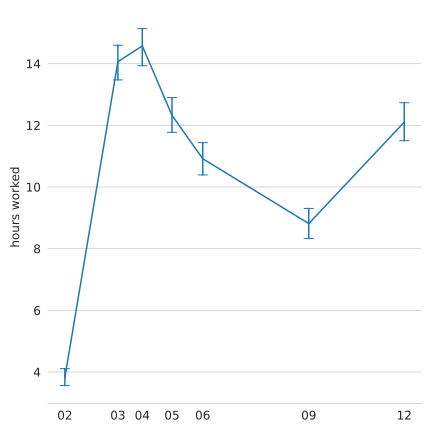{width="48%"}

# Persistence

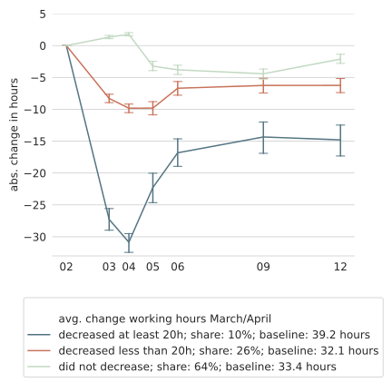{width="48%"}
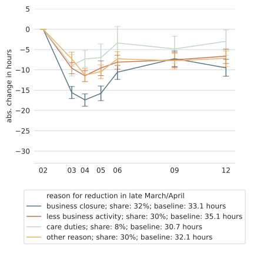{width="48%"}

# Non-Essential vs. Essential Work

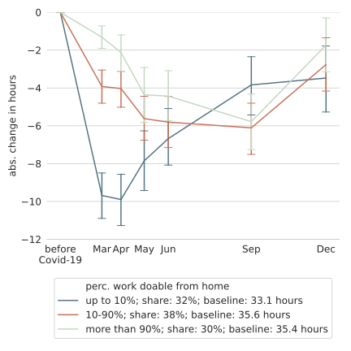{width="48%"}
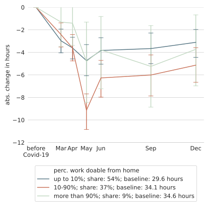{width="48%"}

# Support Programmes

- NOW: Labour subsidies scheme
  - Loss in firm revenue ≥ 20% ⟶ Reimbursement of 30% of wage bill
  - Cannot fire workers
  - No other strings attached
- TOZO: Income support measure for self-employed
- TOGS: One-time payment for entrepeneurs in directly affected sectors

# Affected by support programme

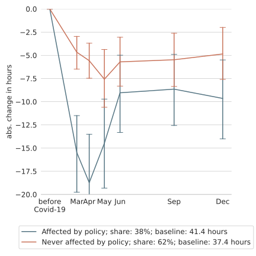{width="48%"}
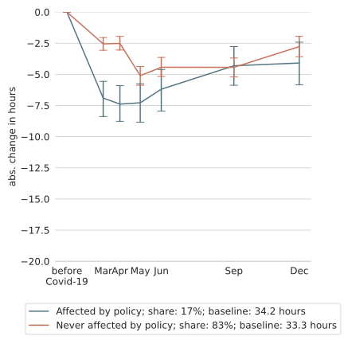{width="48%"}

# Inequality

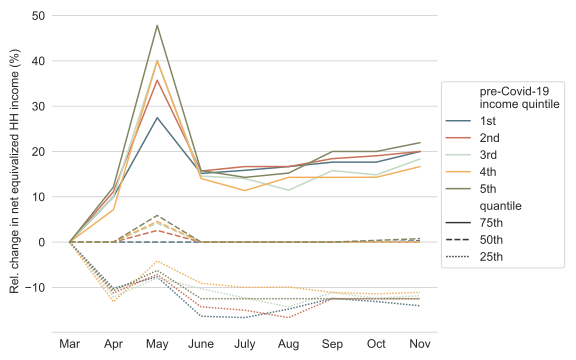

# Hours worked / wfh by Gender

{width="48%"}
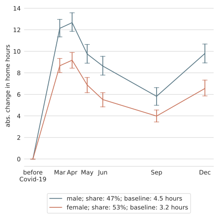{width="48%"}

# Hours worked by kids at home

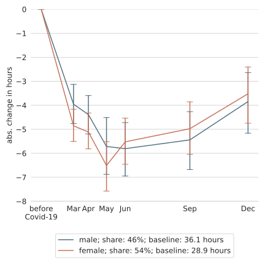{width="48%"}
{width="48%"}

# Mental health

- 5-item mental health inventory (MHI-5) — anxiety/depression
- Questions referring to past 4 weeks, e.g. "I felt calm and peaceful"
- 6 point scales, add up to indicator with scale
  - 100 "perfect" mental health
  - 0 worst possible outcome
- Pre-clinical screening: Scores below 60 warrant further investigation
- Focus on working age population

# MHI-5, entire sample

{width="80%"}

# MHI-5, shared add'l caregiving

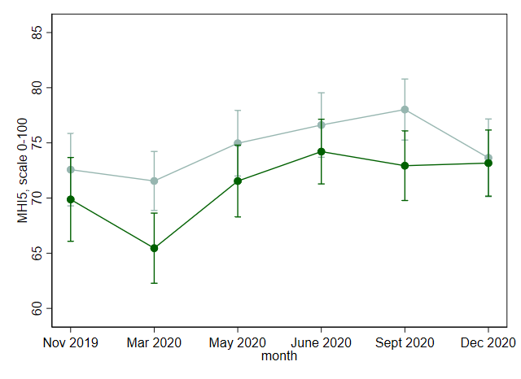{width="80%"}

# MHI-5, respondent add'l caregiver

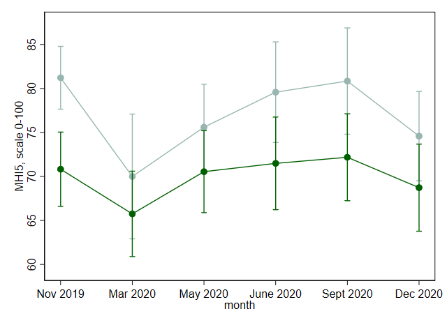{width="80%"}

# MHI-5, partner add'l caregiver

{width="80%"}

# Takeaways

- Shock to labour markets reasonably well buffered so far. Likely combination of
  - Firing restrictions
  - Generous STW scheme, support for small self-employed
  - Existing infrastructure for welfare payments
- Work hours of women (relatively) well preserved
  - Consequence of highly subsidised daycare with comparably short
    hours?
  - Short school closures (≅2-3 months) very likely key
- Mental health
  - Huge short-term drop initially in lockdown, quickly back
  - Drop largest in families where men took on initial burden
  - Large roles for infection risk, labour market risk, loneliness

# Why LISS?

- LISS: Online Panel in the Netherlands, running since 2007
  - Similar efforts: ALP, UAS, CentERpanel, GIP, GESIS Online Panel
- Based on probability sample
- Can follow-up in the long run
  - LISS background questionnaires
  - ≈85% of respondents can be linked to administrative microdata
- Prior working relationship

# Our efforts

- Six waves of CoViD-19 surveys
  - March 20-31, April, May, June, September, December
  - Broad range of things relevant in pandemic
  - See <https://liss-covid-19-questionnaires-documentation.readthedocs.io/>
- Time use & consumption
  - April (only past 30 days)
  - November (as usual)
- Funding: DFG via ECONtribute and CRC/TR 224, NWO, IZA, CPB, Tilburg U, CentERdata

# Probability sample important (Example: Germany)

- Adams-Prassl, Boneva, Golin, Rauh: Inequality in the Impact of the Coronavirus Shock: Evidence from Real Time Surveys, JPubE 2020:

  **34% on short-time work in April 2020**

- SOEP-CoV-Study:

  **17% on short-time work in April 2020**

- Invite access panel, stop at N=4,000 paid for, then weight to get "representativeness"?
- Similar points for U.K. in  Crossley, Fisher, Low: The Heterogeneous and Regressive Consequences of COVID-19: Evidence from High Quality Panel Data, JPubE 2020

# Random thoughts

- Country barrier still important -- "monitoring"-style output only on hours of work together with CPB
- Hard to get a sense of what is important in neighbouring country in real time
- Long-run usability important
- Speed: Some mechanism for short-term funds?
- Real-time admin data possible?