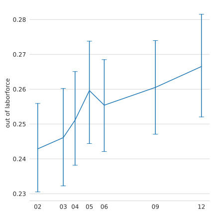
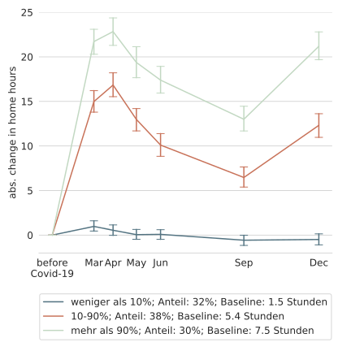

Forschungsprojekt
=================

* Vortrag basiert auf: Zimpelmann, C., Gaudecker, H.-M. von, Holler, R., Janys, L., & Siflinger, B. M. (2021). _Working hours and household income dynamics during the different stages of the pandemic_. Mimeo.
* Forschungsgruppe: CoViD-19-Impact-Lab
    * Wissenschaftler:innen des IZA und der Universitäten Bonn, Mannheim, Tilburg 
    * Impuls: Pandemie wirtschafts- und sozialwissenschaftlich begleiten
    * Datenerhebung in der Niederlande

<!-- LISS Panel
==========

* Online Panel: Dieselben Personen / Haushalte werden immer wieder befragt
* Online, läuft seit 2007
* Wahrscheinlichkeitsbasierte Stichprobe, ~7000 Personen
* Reichhaltige Hintergrunddaten -->

Eigene Datenerhebung
====================
* LISS Panel: online, wahrscheinlichkeitsbasierte Stichprobe, ~7000 Personen
* Untersuchungsgegenstand: Auswirkungen der Pandemie auf Entscheidungen und Erwartungen von Haushalten
* 6 Wellen von Ende März bis Mitte Dezember
    * Arbeitsstunden zu Hause und am Arbeitsplatz
    * Berufsmerkmale: Möglichkeit von zu Hause zu arbeiten; Systemrelevanz der Tätigkeit
    * Erwartungen
    * ...

# Die Pandemie in der Niederlande

{width="60%"}

* Infektionen und staatliche Eingriffe ähnlich wie in Deutschland
* Nur geringer Anstieg der Nichterwerbspersonen und der Arbeitslosigkeit

<!-- Arbeitsplatzverluste
====================

{width="40%"}
{width="40%"}

* Nur geringer Anstieg der Nichterwerbspersonen und der Arbeitslosigkeit -->

# Arbeitsstunden

* Wir betrachten unbedingte Arbeitsstunden

{width="40%"}
{width="40%"}

im Homeoffice \ \ \ \ \ \ \ \ \ \ \ \ \ \ \ \ \ \ \ \ \ \ \ \ \ \ \ \ \ \ \ \ \ \ \ \ \ \ \ \ \ \ \ \ \ \ \ \ Gesamt

# Vergleich Homeoffice Dezember gegenüber März/April
* Weniger Homeoffice als während des ersten Lockdowns
    - 52% vs 57% mindestens 1h im HO
    - 73% vs 80% der Stunden im HO (geg. mindestens 1h)

Möglichkeit auf Homeoffice
===========================

{width="40%"}
{width="40%"}

# Auswirkungen auf die Ungleichheit der Einkommen

# Recht auf Homeoffice während Corona?

* Epidomeologische Simulationsmodelle: großer Effekt von mehr Arbeit im Homeoffice auf die Entwicklung der Pandemie
* z.B. Gabler, J., Raabe, T., & Roehrl, K. (2020). _People Meet People: A Microlevel Approach to Predicting the Effect of Policies on the Spread of Covid-19_. Mimeo.
* Erscheint sinnvoll, insbesondere in Anbetracht anderer Einschränkungen

Entwicklung Homeoffice nach Corona?
===========================
* In unserem Datensatz:
    * Vor Corona: 3,8h im Homeoffice
    * Nach Corona erwartet: 8h im Homeoffice
    * Nach Corona erwünscht: 9h im Homeoffice

