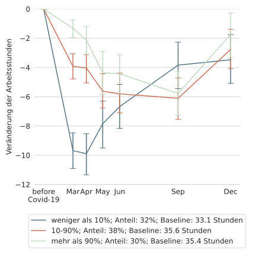

CoViD-19 Impact Lab
===================

* Gruppe von Wissenschaftler:innen des IZA und der Universitäten Bonn, Mannheim, Tilburg 
* Impuls: Pandemie wirtschafts- und sozialwissenschaftlich begleiten

LISS Panel
==========

* Panel: Dieselben Personen / Haushalte werden immer wieder befragt
* Online, läuft seit 2007
* Wahrscheinlichkeitsbasierte Stichprobe, ~7000 Personen
* Reichhaltige Hintergrunddaten

Eigene Datenerhebung
====================
* 6 Wellen von Ende März bis Mitte Dezember
    * Arbeitsstunden zu Hause und am Arbeitsplatz
    * Berufsmerkmale: Möglichkeit von zu Hause zu arbeiten; Systemrelevanz der Tätigkeit
    * Erwartungen
    * ...

Arbeitsplätze
====================

{width="48%"}
{width="48%"}

Arbeitsstunden
==============

* Wir betrachten unbedingte Arbeitsstunden (im Home Office und am Arbeitsplatz)

{width="40%"}
{width="40%"}

Vergleich Dez vs Mär/Apr
=======================================================

- 52% vs 57% mindestens 1h im HO
- 73% vs 80% der Stunden im HO (geg. mindestens 1h)

Möglichkeit auf Home Office
=======================================================

{width="40%"}
{width="40%"}

Systemrelevanz
==========================================================================

{width="48%"}
{width="48%"}

Wer kann von zu Hause arbeiten?
===============================

*

Entwicklung HO nach Corona?
===============================================

* Vor Corona: 3,8h im HO
* Nach Corona erwartet: 8h im HO
* Nach Corona erwünscht: 9h im HO

