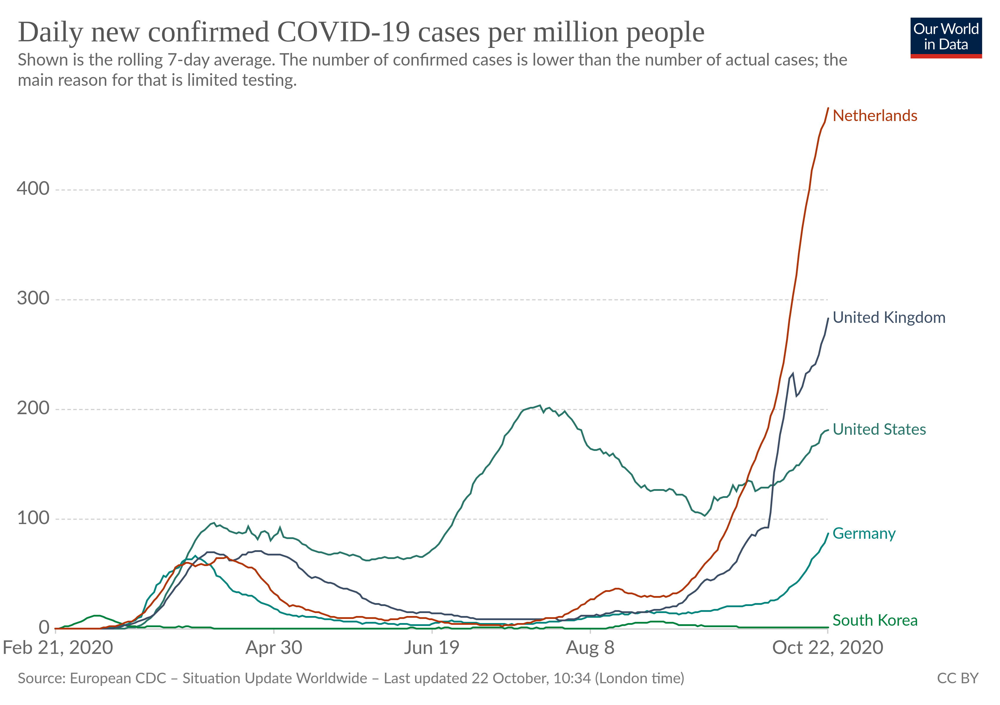
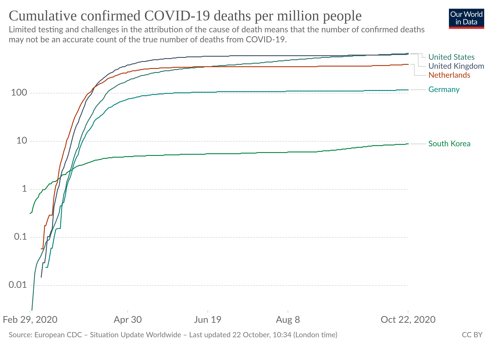
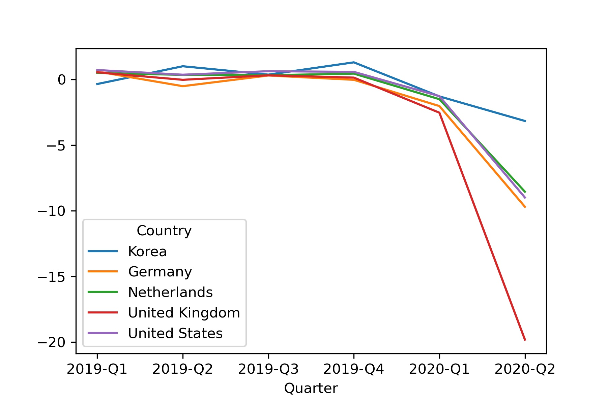
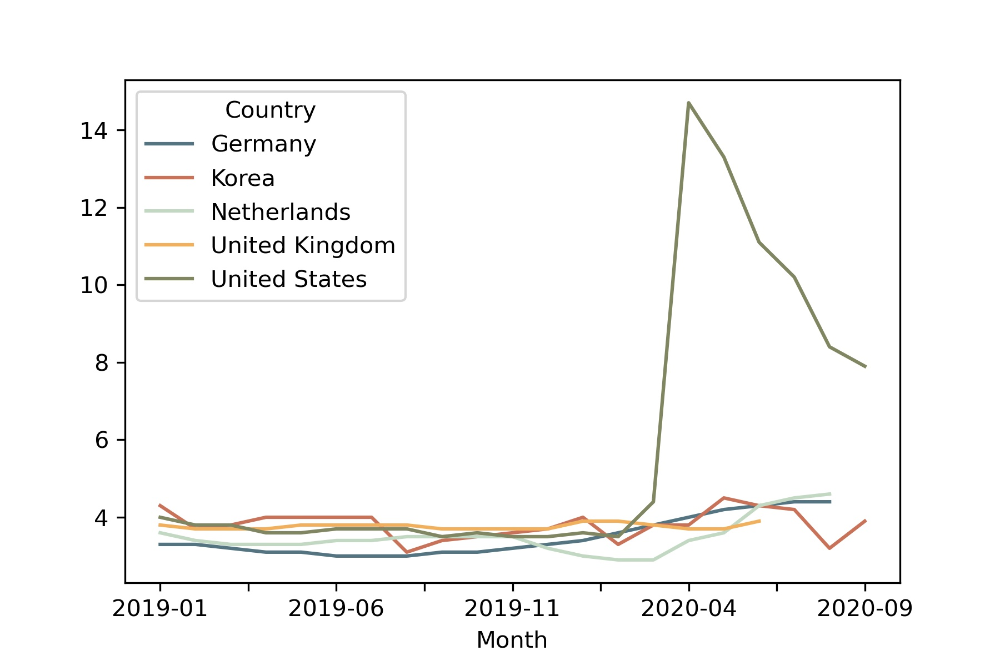
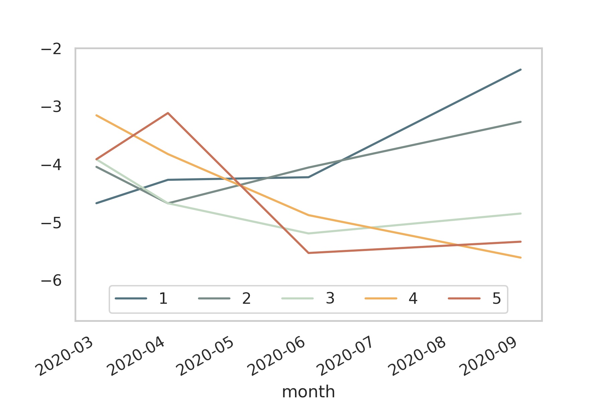
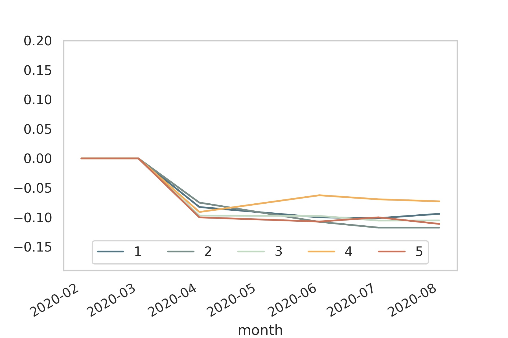
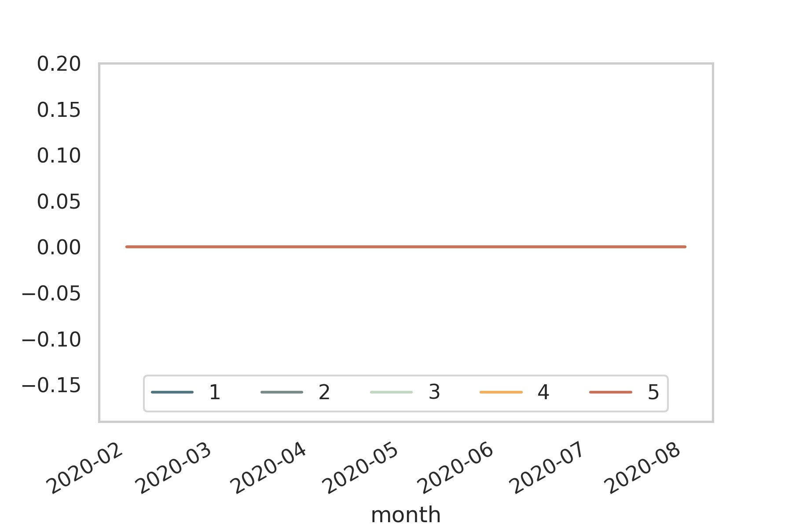
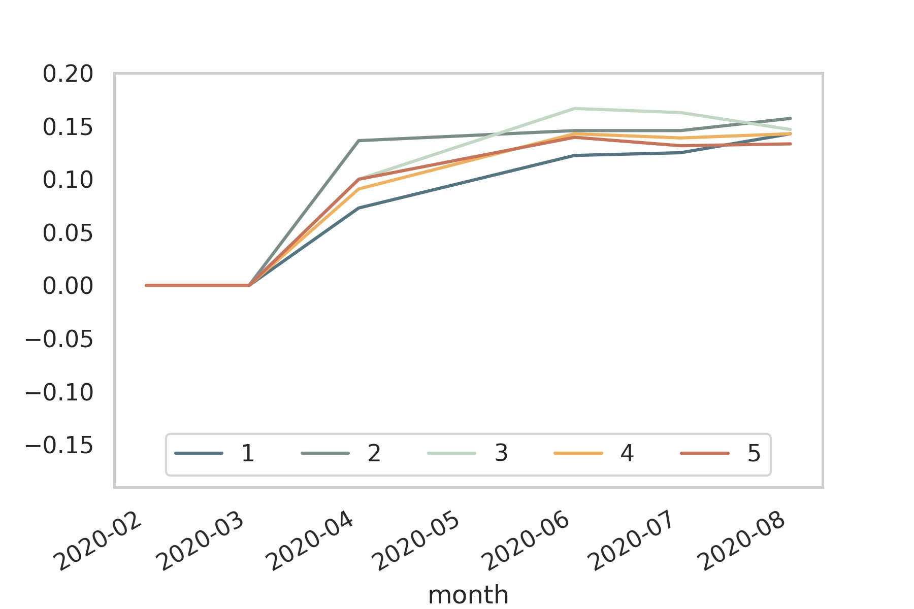

:Title: Social protection during the CoViD-19 crisis: A view from Western Europe
:Course: Webinar of the AKES: Implementation of the inclusive social protection scheme in an era of COVID-19 pandemic
:Authors: Hans-Martin v. Gaudecker
:Organization: Universität Bonn & IZA
:Copyright: Creative Commons

Outline
=======

* Aggregate Context
* Policy reactions
* Inequality outcomes

Daily new cases per million
===========================

Cumulative deaths per million
=============================

Q-on-Q GDP Growth
=================

Monthly unemployment rate
=========================

.. raw:: latex
    
    \clearpage

Pandemic policy
===============

- NL / Germany: Broadly similar
  - Shelter-in-place policies came reasonably early, milder than in other countries
  - Main difference after summer: Masks
- United Kingdom
  - Shelter-in-place came late, ended up longer and harder
- United States:
  - Late reaction, no clear policy at federal level
  - States very different
  - More politics than science

Social policy: Labour hoarding
==============================

- Netherlands
  - Gov't reimburses wages partly as a function of lost revenue; no strings attached
  - Direct payments to (SMEs in) directly affected sectors
  - Deferral of past tax payments, possibility to offset with 2020 losses
- Germany
  - Gov't reimburses wages conditional on working time reduction
  - Credit guarantees for firms 
  - Direct payments to (SMEs) in directly affected sectors
  - Easier access to social transfer programs
- United Kingdom
  - Gov't reimburses part of the wage bill conditional on not working at all

.. raw:: latex
    
    \clearpage

Data Source
===========

* LISS: Online Panel in the Netherlands, running since 2007
* Based on probability sample
* Roughly 5,000 households / 7,500 individuals
* Each month, respondents get 30 minutes of questionnaires

  * Background data on Work, Health, Income, ...
  * Additional questionnaires designed by researchers

* Around 85% of respondents can be linked to administrative microdata (not today)

CoViD-19 surveys
================

* See https://liss-covid-19-questionnaires-documentation.readthedocs.io/
* **March 20-31:** Risk perceptions, behavioural reactions and preferences re social distancing policies, changes in the work and childcare situation, intentions and expectations regarding consumption/savings decisions, mental health
* **April 6-28:** Risk perceptions, number of personal contacts, changes in the work situation, income and macro expectations
* **May** Mostly labour, some health, home schooling
* **June** Mostly labour, lots of job search, how do parents deal with opening of daycares / primary schools?
* **September**: Risk perceptions, support for policies, changes in the work situation, income and macro expectations

U.K. comparison
===============
* Understanding Society: Largest household panel in the U.K.
* A subset of respondents have received CoViD-19 surveys similar to ours since April
* Numbers here are taken from `Crossley, Fisher, Low (2020) <https://www.economics.ox.ac.uk/materials/working_papers/5413/tcpfhlcovidshort.pdf>`_

Δ hours by income quintile
==========================

Δ income by quintile, p25 
=========================

Δ income by quintile, p50 
=========================

Δ income by quintile, p25 
=========================

.. raw:: latex
    
    \clearpage

Same numbers for U.K., Δ May, Feb 2020
======================================

+-----------------+-------+-------+------+
| Income quintile |  p25  | p50   | p75  |
+=================+=======+=======+======+
| 1               | -0.6  | -0.13 | 0.04 |
+-----------------+-------+-------+------+
| 2               | -0.36 | -0.06 | 0.07 |
+-----------------+-------+-------+------+
| 3               | -0.34 | -0.03 | 0.04 |
+-----------------+-------+-------+------+
| 4               | -0.43 | -0.08 | 0.04 |
+-----------------+-------+-------+------+
| 5               | -0.39 | -0.02 | 0.08 |
+-----------------+-------+-------+------+

Conclusion
==========

* Inequality impact an order of magnitude lower in NL (≅DE) compared to U.K. (≅U.S.)
* Ideal social policy is preserving employment relations in the short run (see also `Jung & Kuester, 2015 <https://www.aeaweb.org/articles?id=10.1257/mac.20130028>`_), not worrying about hours worked
* In the short run, 
  - there is no trade-off economy / controlling the pandemic. 
  - short lockdowns mitigate the inequality impact
* Large option value of functioning social insurance systems: Know how to reach vulnerable parts of the population
