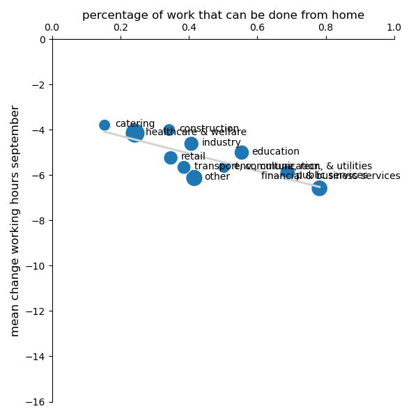

:Title: Social protection during the CoViD-19 crisis: A view from Western Europe
:Course: Implementation of the inclusive social protection scheme in an era of COVID-19 pandemic
:Authors: Hans-Martin v. Gaudecker
:Organization: Universität Bonn & IZA
:Copyright: Creative Commons

Story
=====

* Inequality impact low compared to Anglo-Saxon
* No trade-off economy / pandemic. Short lockdowns useful when it comes to inequality impact
* Option value of functioning social insurance systems

Background
==========

* LISS: Online Panel in the Netherlands, running since 2007
* Based on probability sample
* Roughly 5,000 households / 7,500 individuals
* Each month, respondents get 30 minutes of questionnaires

  * Background data on Work, Health, Income, ...
  * Questionnaires designed by researchers (~85c / minute / respondent)

* Around 85% of respondents can be linked to administrative microdata

CoViD-19 surveys
================

* See https://liss-covid-19-questionnaires-documentation.readthedocs.io/
* **March 20-31:** Risk perceptions, behavioural reactions and preferences re social distancing policies, changes in the work and childcare situation, intentions and expectations regarding consumption/savings decisions, mental health
* **April 6-28:** Risk perceptions, number of personal contacts, changes in the work situation, income and macro expectations
* **May** Mostly labour, some health, home schooling
* **June** Mostly labour, lots of job search, how do parents deal with opening of daycares / primary schools?
* **September**: Risk perceptions, support for policies, changes in the work situation, income and macro expectations

(CoViD-19) Time use & consumption
=================================

* **November 2019**: Baseline, helped redesign survey
* **April 21-28:** Similar to November 2019 edition, adapted to lockdown situation
* **November**: Similar to November 2019, adapted to current situation

.. Some results
.. =============

.. * Hours worked by essential worker status and capability to work from home
.. * Gender division of tasks

Hours worked
============

.. image:: work-childcare/abs-change-hours-over-time-by-work_perc_home_cat.png

.. |pic1|  |pic2|

.. .. |pic1| image:: work-childcare/abs-change-hours-over-time-by-work_perc_home_cat_only_noness-full-unconditional.png
..    :width: 35%

.. .. |pic2| image:: work-childcare/abs-change-hours-over-time-by-work_perc_home_cat_only_ess-full-unconditional.png
..    :width: 35%

Hours worked from home
===========================

.. image:: work-childcare/abs-change-hours-home-over-time-by-work_perc_home_cat.png

.. |pic3|  |pic4|

.. .. |pic3| image:: work-childcare/abs-change-hours-home-over-time-by-work_perc_home_cat_only_noness-full-unconditional.png
..    :width: 35%

.. .. |pic4| image:: work-childcare/abs-change-hours-home-over-time-by-work_perc_home_cat_only_ess-full-unconditional.png
..    :width: 35%

Hours worked by sector (March)
==============================

.. image:: work-childcare/sector_change_ind_by_work_perc_march.png

Hours worked by sector (June)
==============================

.. image:: work-childcare/sector_change_ind_by_work_perc_june.png

Hours worked by sector (September)
==================================

Gender division of tasks
========================

* On average, women reduce one hour extra during lockdown, effect vanishes by June
* No addtional effect of children being present in the household on either parent!
* If both parents work full-time before pandemic: roughly equal shares of additional childcare

  * Typically 37 + 32 hours than 45 + 45

* Combinations FT / PT or FT / no work: Gender care gap increases

Full-time / Non-working couples
=========================================

.. image:: work-childcare/stacked-bar-plot-market-nonmarket-details-split-50-fulltime-olf.png

Full-time / Part-time couples
=========================================

.. image:: work-childcare/stacked-bar-plot-market-nonmarket-details-split-50-fulltime-parttime.png

Full-time x2 couples
=========================================

.. image:: work-childcare/stacked-bar-plot-market-nonmarket-details-split-50-both-fulltime.png

.. Other current projects
.. ======================

.. * Mental health
.. * Evolution of income / macro expectations

Overall conclusions
====================

- Cross-country evidence: No effect of restrictions on aggregate economic activity
- Inequality impact
  - mitigated by keeping lockdowns short
  - employment / income protection crucial in the short run
- Gender division: Heterogeneous
  - Not back to the 1950s
  - Western European model more resilient during crisis than Anglo-Saxon one
  - Some glimpses of hope by changed norms in long run (home office days also for men)