# Cases / Containment Measures

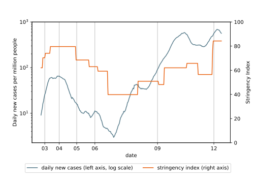{width="80%"}

# Key messages

- Labour market:
  - Small effects on extensive margin
  - Hours of work took deep dive, back up quickly
  - Early support programmes worked well, no rise in inequality
- Gender division of tasks:
  - Women reduce hours more initially
  - Presence of children does not affect either parent's hours
  - Pre-Pandemic allocation of care tasks is reinforced
- Mental well-being:
  - Strong reduction in mental health score in March
  - Back up to ≈normal levels by May
  - Very different for parents depending on who buffers shock

# Based on three papers

1. Zimpelmann, C., Gaudecker, H.-M. von, Holler, R., Janys, L., Siflinger, B. M., (2021). _Drivers of working hours and household income dynamics during the CoViD-19 pandemic: The case of the Netherlands_. Mimeo, previous versions as IZA DPs.
2. Holler, R., Janys, L., Zimpelmann, C., Gaudecker, H.-M. von & Siflinger, B. M.  (2021). _The early impact of the CoViD-19 Pandemic on the Gender Division of Market and Household Work_. Mimeo.
3. Siflinger, B., Paffenholz, M., Seitz, S., Mendel, M., Gaudecker, H.-M. von (2021). _The CoViD-19 Pandemic and Mental Health: Distentangling Crucial Channels_. IZA DP No. 14266.

# Data: Background

- LISS: Online Panel in the Netherlands, running since 2007
  - Similar efforts: ALP, UAS, CentERpanel
- Based on probability sample
- Roughly 5,000 households / 7,500 individuals
- Each month, respondents get ≈30 minutes of questionnaires
- ≈85% of respondents can be linked to administrative microdata (not today)

# Data: CoViD-19 surveys, Time Use

- CoViD-19 questionnaires
  - March 20-31, April 6-28, May, June, September, December
  - See <https://liss-covid-19-questionnaires-documentation.readthedocs.io/>
  - Hours of work, some childcare, mental health, covariates
- Time use & consumption questionnaires
  - November 2019: Baseline
  - April / November 2020: Adapted to lockdown situation

# LFP / Unemployment rates

{width="48%"}
{width="48%"}

# Hours of work (actual)

- Closest short-term measure for labour market activity in presence of
   - firing restrictions
   - employment subsidies
- Interpretation as labour demand / direct restrictions seems fine
   - e.g., see below that no additional effect for parents
- Measurement before CoViD-19 likely a bit too high

# Hours worked / worked from home

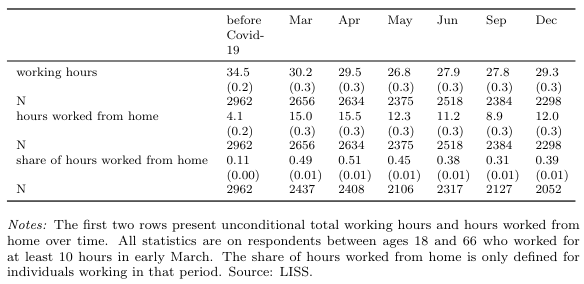{width="70%"}

# Inequality trends (hours worked)

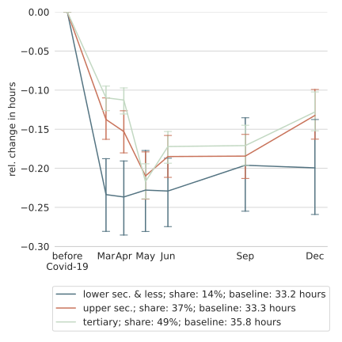{width="48%"}
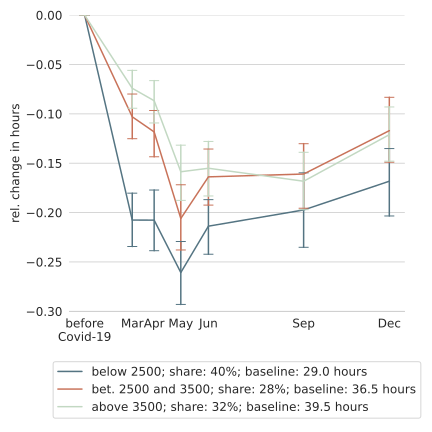{width="48%"}

# Inequality trends (hours wfh)

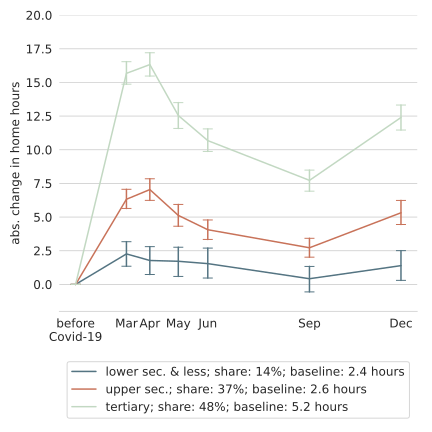{width="48%"}
{width="48%"}

# Inequality trends (hh inc)

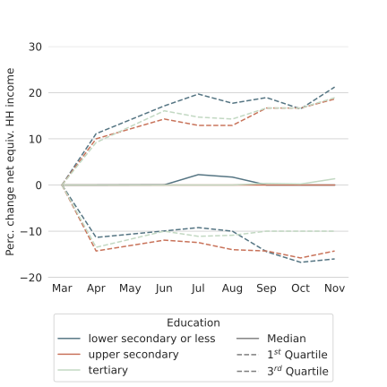{width="60%"}

# Inequality trends (hh inc)

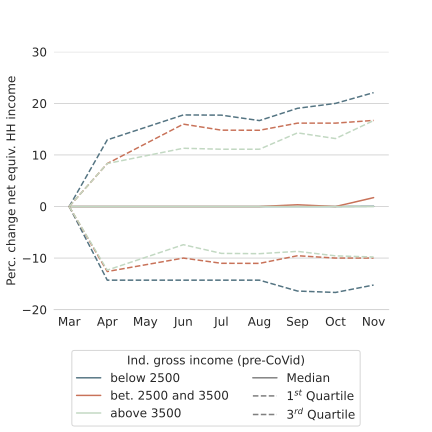{width="60%"}

# Inequality trends (hh inc)

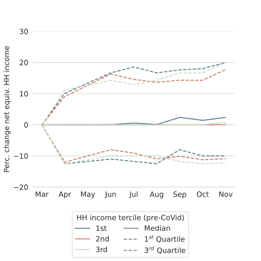{width="60%"}

# Explanations (hours)

- Regress hours worked on fixed effect and month ⨉ 

  - education
  - income
  - essential worker
  - fraction of work doable from home
  - essential worker fraction of work ⨉ doable from home
  
  interactions

# Explanations (hours)

- Only education / income: Large and significant
- Effects vanish completely / almost fully when adding pandemic-specific mechanisms
- Most important during early lockdown
- Almost gone June-September
- Back in December, weaker

# Explanations (hh income)

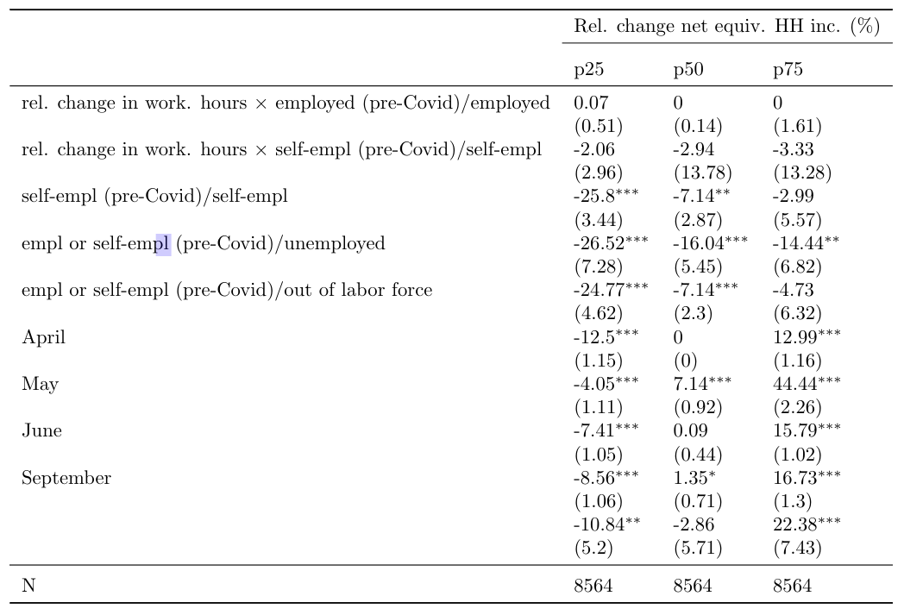{width="75%"}

# Support Programmes

- NOW: Labour subsidies scheme
  - Loss in firm revenue ≥ 20% ⟶ Reimbursement of 30% of wage bill
  - Cannot fire workers
  - No other strings attached
- TOZO: Income support measure for self-employed
- TOGS: One-time payment for entrepeneurs in directly affected sectors

# Explanations (hh income)

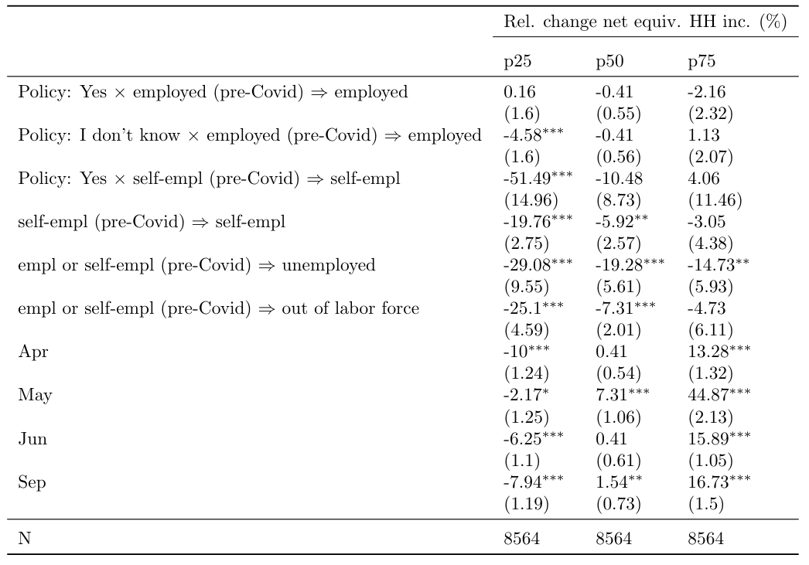{width="75%"}

# Hours worked / wfh by Gender

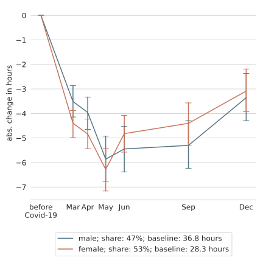{width="48%"}
{width="48%"}

# Hours worked by kids at home

{width="48%"}
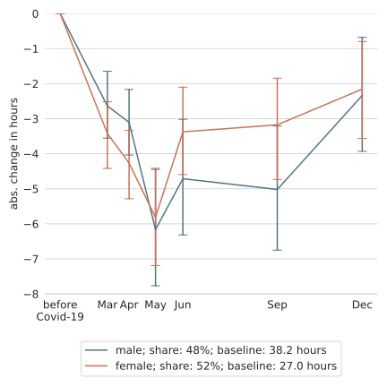{width="48%"}

# Fixed effects regressions

- Hours of work on gender × month, controls
- Large heterogeneity
  - Non-essential FT women reduce 3 **more** hours during lockdown
    than non-essential men
  - Essential FT women reduce 1.5 hours **less** than non-essential
    men
- Rich controls on RHS, exact set does not matter:
  - month × gender × (1, part time, essential worker, age)
  - month × (age, percentage of work doable from home,
    self-employment, profession, sector)
- Add gender × month × school children at home
  - No change (precise zero or hours slightly **better** preserved
    among parents)
  - Coefficients very similar when restricting sample to 2-parent
    families

# Childcare gap by mother's hours

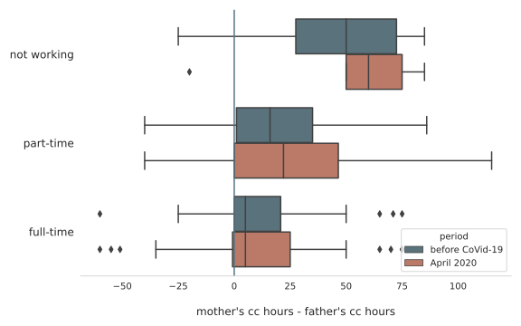

# Mental health

- 5-item mental health inventory (MHI-5) — anxiety/depression 
- Questions referring to past 4 weeks, e.g. "I felt calm and peaceful" 
- 6 point scales, add up to indicator with scale
  - 100 "perfect" mental health
  - 0 worst possible outcome
- Pre-clinical screening: Scores below 60 warrant further investigation
- Focus on working age population

# MHI-5, entire sample

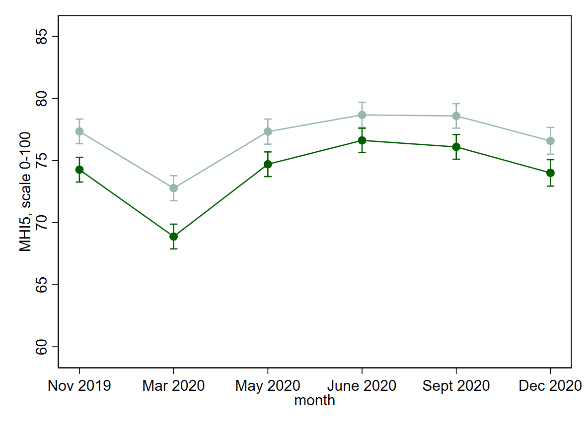{width="80%"}

# MHI-5, shared add'l caregiving

{width="80%"}

# MHI-5, respondent add'l caregiver

{width="80%"}

# MHI-5, partner add'l caregiver

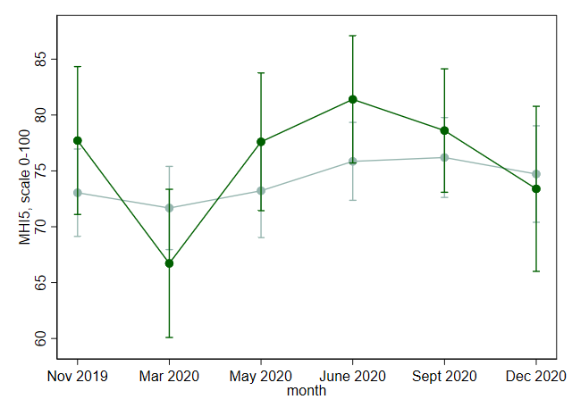{width="80%"}

# Takeaways

- Shock to labour markets reasonably well buffered so far. Likely combination of
  - Firing restrictions
  - Generous STW scheme, support for self-employed / small businesses
  - Existing infrastructure for welfare payments
- Work hours of women (relatively) well preserved
  - Consequence of highly subsidised daycare with comparably short hours?
  - Short school closures (≅2-3 months) very likely key
- Gender division of tasks during CoViD-19: Very heterogeneous
  - Neither back to the 1950s, nor the great equalizer
  - Pre-existing patterns re-inforced
- Mental health
  - Huge short-term drop initially in lockdown, quickly back
  - Drop largest in families where men took on initial burden
  - Large roles for infection risk, labour market risk, loneliness
